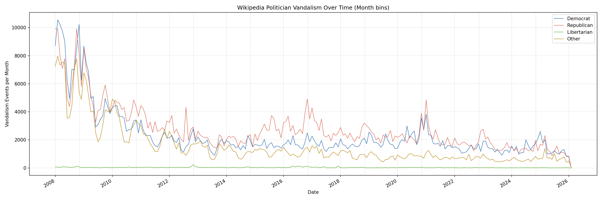

# Wikipedia Politician Vandalism: A Big Data Analysis

## Hypothesis

Do Wikipedia articles for certain politicians or political parties experience more vandalism than others, and does vandalism increase around elections? The hypothesis was that Democratic politicians would be more frequently vandalized, based on the observation that accounts portraying themselves as conservative tend to be more antagonistic on social media platforms.

## Dataset and Methodology

The dataset consists of 27 English Wikipedia stub-meta-history XML dump files (~100 GB compressed, ~750 GB uncompressed) obtained from Wikimedia Downloads, containing the complete revision history of every English Wikipedia article. A list of 75,540 US politician and political party Wikipedia article titles was compiled by querying Wikidata, and party affiliations were retrieved using Wikidata property P102 (member of political party). After streaming through all 27 dump files, 9,541,529 revision records across 75,503 politician pages were extracted. The two major parties have nearly equal representation: 28,595 Democrat articles and 28,320 Republican articles, along with 90 Libertarian and 18,535 Other.

Vandalism was detected using SHA1 content hash revert detection: when a revision's content hash matches a previous non-adjacent revision, the intermediate edits are classified as vandalism and the matching revision as a restoration. This method was corroborated by keyword analysis of edit summaries -- 32.3% of detected events also contained explicit revert or vandalism keywords such as "revert," "vandal," "undid," or "rvv." In total, **2,684,002 vandalism edits** were identified, affecting 39,716 of the 75,503 politician pages. Of these, 45.5% of vandalism edits came from anonymous (IP-only) editors and 54.5% from registered accounts.

## All-Time Results (2001--2026)

### Party-Level Vandalism

Across the full 25-year history, Republican politician articles received nearly half of all vandalism, far exceeding their share of articles:

| Party | Articles | Vandalism Edits | Per Article | % of total Articles | % of total Vandalism |
|---|---|---|---|---|---|
| Democrat | 28,595 | 801,987 | 28.0 | 37.9% | 29.9% |
| Republican | 28,320 | 1,320,865 | 46.6 | 37.5% | 49.2% |
| Libertarian | 90 | 8,243 | 91.6 | 0.1% | 0.3% |
| Other | 18,535 | 552,907 | 29.8 | 24.5% | 20.6% |

Despite the two major parties having nearly equal numbers of articles, Republican politicians received 46.6 vandalism events per article compared to 28.0 for Democrats -- 66% more per article. This all-time gap is heavily influenced by the George W. Bush article, which alone accumulated 421,884 vandalism edits during the explosive early Wikipedia era, more than the next eight most-vandalized politicians combined.

### Most Vandalized Politicians (All Time)

| Rank | Politician | Party | Vandalism Events |
|---|---|---|---|
| 1 | George W. Bush | Republican | 421,884 |
| 2 | Donald Trump | Republican | 49,296 |
| 3 | Barack Obama | Democrat | 41,159 |
| 4 | John Kerry | Democrat | 30,642 |
| 5 | Republican Party (article) | Republican | 29,017 |
| 6 | Ronald Reagan | Republican | 28,490 |
| 7 | Kane (Glenn Jacobs) | Republican | 28,244 |
| 8 | Joseph Smith | Other | 26,554 |
| 9 | George Washington | Other | 24,823 |
| 10 | Bill Clinton | Democrat | 24,393 |

The all-time list is dominated by presidents and presidential candidates. The top four are all 21st-century presidential figures, reinforcing that vandalism correlates strongly with current political visibility. The Republican Party's own article is the 5th most vandalized political page on all of Wikipedia.

### Vandalism Over Time (All Time)

The all-time monthly plot reveals a massive vandalism spike in 2005--2006, dominated by Republican-article vandalism (primarily the George W. Bush page during his presidency). This early period predates Wikipedia's modern anti-vandalism infrastructure. The peak month across the entire dataset was October 2005 with 62,388 vandalism edits, and all five of the highest-vandalism months occurred in the second half of 2005. The longest stretch without any vandalism was 251 days in early 2001, when Wikipedia was still in its infancy.

### All-Time Restoration Times

| Party | Mean | Median |
|---|---|---|
| Democrat | 5,426 hrs | 60.2 hrs |
| Republican | 7,273 hrs | 643.0 hrs |
| Libertarian | 12,640 hrs | 469.4 hrs |
| Other | 4,718 hrs | 91.8 hrs |

The five fastest-restored politician pages (Gordon Lau, Anthony Como, Earle Cabell, John Paterson, Charles L. Butts) all had median restoration times near zero, indicating that vandalism was caught and reverted almost immediately by watchlist editors or bots. Conversely, pages like Oramel H. Simpson (median 115,729 hours) and Mike Huckabee (median 75,603 hours) went years between vandalism and restoration, suggesting these lower-profile pages lack active monitoring.

## Post-2008 Results (Excluding the Early Boom)

Because the 2001--2007 period represents a fundamentally different Wikipedia -- before anti-vandalism bots, before semi-protection policies, and during explosive user growth -- the analysis was repeated using only data from 2008 onward (1,474,016 vandalism events, 55% of the total).

### Party-Level Vandalism (2008+)

| Party | Articles | Vandalism | Per Article | % of Articles | % of Vandalism |
|---|---|---|---|---|---|
| Democrat | 28,595 | 509,970 | 17.8 | 37.9% | 34.6% |
| Republican | 28,320 | 612,083 | 21.6 | 37.5% | 41.5% |
| Libertarian | 90 | 6,999 | 77.8 | 0.1% | 0.5% |
| Other | 18,535 | 344,964 | 18.6 | 24.5% | 23.4% |

With the early boom excluded, the gap narrows but persists: Republicans receive 21.6 vandalism events per article versus 17.8 for Democrats, about 21% more. The Republican share of vandalism drops from 49.2% to 41.5%, while the Democratic share rises from 29.9% to 34.6%. The post-2008 top 10 shifts accordingly: Donald Trump (42,205) leads, followed by Barack Obama (32,110), Joe Biden (13,975), and other modern figures from both parties.

  Top 10 most vandalized (2008+):
     1. Donald Trump (Republican): 42,205
     2. Barack Obama (Democrat): 32,110
     3. Joseph Smith (Other): 20,715
     4. Kane (wrestler) (Republican): 19,266
     5. Joe Biden (Democrat): 13,975
     6. Dwight D. Eisenhower (Republican): 13,710
     7. Republican Party (United States) (Republican): 13,239
     8. Ronald Reagan (Republican): 13,045
     9. George W. Bush (Republican): 12,587
    10. Democratic Party (United States) (Democrat): 11,577

### Vandalism Over Time (2008+)

Without the 2005 spike dominating the y-axis, the post-2008 plot reveals richer detail. There is a clear downward trend over time, likely reflecting Wikipedia's improved anti-vandalism tools. Dashed vertical lines mark US general elections. Notable spikes appear around the 2008--2009 Obama inauguration, the 2016 Trump election, and the 2020--2021 election and Capitol events. Republican vandalism (red) consistently runs above Democratic vandalism (blue), though the lines converge in recent years.

### Election Proximity Effect

Vandalism consistently increases in the months following elections. In 11 of 12 election cycles from 2002 to 2024, the 3 months after the election saw more vandalism than the 3 months before:

| Election | Before | After | Change |
|---|---|---|---|
| 2004 | 13,000 | 36,424 | +180.2% |
| 2016 | 17,021 | 23,350 | +37.2% |
| 2020 | 14,899 | 23,861 | +60.2% |
| 2022 | 10,655 | 14,395 | +35.1% |
| 2024 | 9,663 | 13,194 | +36.5% |

The 2020 election showed the largest modern post-election spike at +60.2%, consistent with the heightened political tensions of that period. The only election with a decrease in post-election vandalism was 2008 (-2.7%).

### Seasonality

| Month | All-Time Total | All-Time Avg/Year | Post-2008 Total | Post-2008 Avg/Year |
|---|---|---|---|---|
| January | 252,686 | 9,719 | 162,201 | 8,537 |
| February | 239,578 | 9,215 | 149,712 | 7,880 |
| March | 228,375 | 8,784 | 140,336 | 7,386 |
| April | 210,651 | 8,102 | 121,882 | 6,415 |
| May | 225,087 | 8,657 | 126,436 | 6,655 |
| June | 170,424 | 6,555 | 96,251 | 5,066 |
| July | 187,399 | 7,208 | 93,913 | 4,943 |
| August | 193,693 | 7,450 | 102,920 | 5,417 |
| September | 207,384 | 7,976 | 106,075 | 5,583 |
| October | 264,621 | 10,178 | 130,612 | 6,874 |
| November | 270,635 | 10,409 | 133,905 | 7,048 |
| December | 233,469 | 8,980 | 109,773 | 5,778 |

All-time, November (270,635 total) and October (264,621) are the highest-vandalism months, aligning directly with election season. Summer months are consistently the lowest, with June averaging 37% less vandalism than November. Interestingly after 2008, the months of January and February saw the highest vandalism averages. This seasonal pattern is consistent with academic calendars -- student-driven editing and vandalizing drops during summer break and peaks during the school year.

### Post-2008 Restoration Times

| Party | Mean | Median |
|---|---|---|
| Democrat | 6,095 hrs | 7.5 hrs |
| Other | 5,511 hrs | 10.2 hrs |
| Republican | 9,619 hrs | 11.5 hrs |
| Libertarian | 14,112 hrs | 1,005 hrs |

Modern median restoration times are dramatically faster than all-time figures. Democrat articles are restored fastest (7.5 hours median), followed by Other (10.2 hours) and Republican (11.5 hours). This suggests that high-profile Democratic pages may have slightly more active watchlist coverage. Libertarian articles, with only 90 pages in the dataset, remain poorly monitored at over 1,000 hours median.

## Conclusion

The hypothesis that Democratic politicians would experience more vandalism was **not supported**. The data shows the opposite: Republican politicians receive more vandalism both in raw counts and when normalized per article, across all time periods analyzed. The all-time disparity (46.6 vs. 28.0 per article) is heavily skewed by the George W. Bush phenomenon during early Wikipedia, but the gap persists even in the modern era (21.6 vs. 17.8 per article post-2008). Vandalism correlates most strongly with political visibility -- sitting presidents and active candidates attract the most attacks regardless of party, as evidenced by Trump and Obama occupying the top two positions in the post-2008 rankings. Elections produce consistent and measurable vandalism spikes, with the post-election period averaging 30--60% more vandalism than the pre-election period in recent cycles. Finally, Wikipedia's moderation ecosystem has improved substantially: median restoration times have fallen from hundreds of hours in the early era to under 12 hours in the modern era, demonstrating that the community's anti-vandalism infrastructure is increasingly effective at protecting political content.
