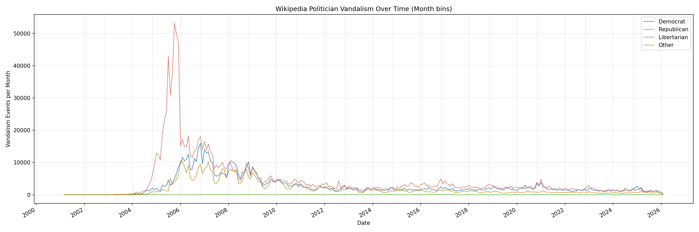
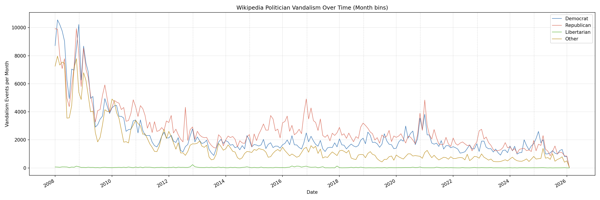
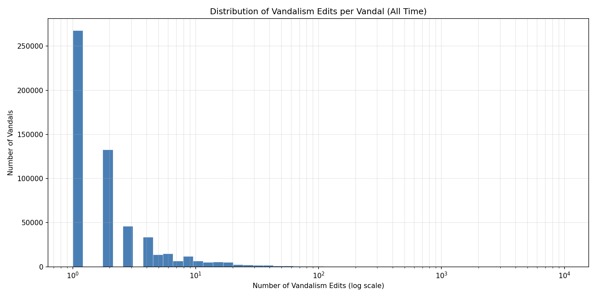
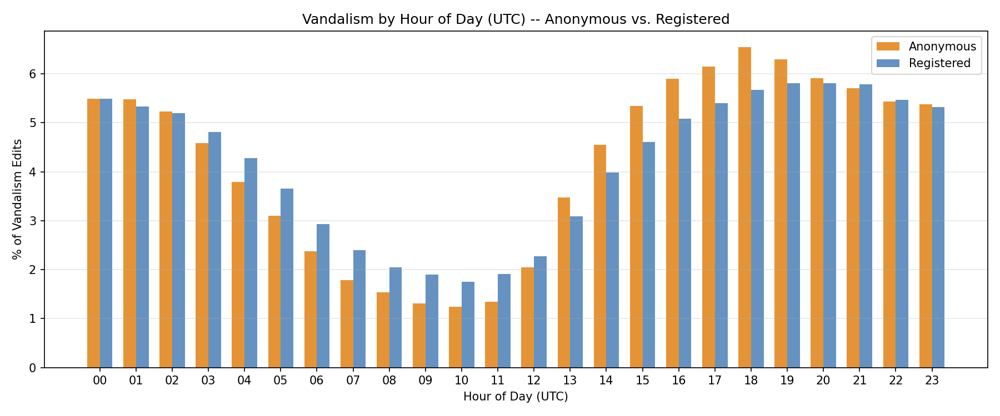

# Wikipedia Politician Vandalism: A Big Data Analysis

## Hypothesis

Do Wikipedia articles for certain politicians or political parties experience more vandalism than others, and does vandalism increase around elections? The hypothesis was that Democratic politicians would be more frequently vandalized, based on the observation that accounts portraying themselves as conservative tend to be more antagonistic on social media platforms.

## Dataset and Methodology

The dataset consists of 27 English Wikipedia stub-meta-history XML dump files (~100 GB compressed, ~750 GB uncompressed) obtained from Wikimedia Downloads, containing the complete revision history of every English Wikipedia article. A list of 75,540 US politician and political party Wikipedia article titles was compiled by querying Wikidata's SPARQL endpoint, and party affiliations were retrieved using Wikidata property P102 (member of political party). After streaming through all 27 dump files with a custom Python XML parser, 9,541,529 revision records across 75,503 politician pages were extracted into Parquet format. The two major parties have nearly equal representation: 28,595 Democrat articles and 28,320 Republican articles, along with 90 Libertarian and 18,535 Other.

Vandalism was detected using SHA1 content hash revert detection: when a revision's content hash matches a previous non-adjacent revision, the intermediate edits are classified as vandalism and the matching revision as a restoration. This method was corroborated by keyword analysis of edit summaries -- 32.3% of detected events also contained explicit revert or vandalism keywords such as "revert," "vandal," "undid," or "rvv," while 67.7% were detected purely by SHA1 hash matching. In total, **2,684,002 vandalism edits** were identified, affecting 39,716 of the 75,503 politician pages. Of these, 45.5% of vandalism edits came from anonymous (IP-only) editors and 54.5% from registered accounts.

Because the 2001--2007 period represents a fundamentally different Wikipedia -- before anti-vandalism bots like ClueBot NG, before semi-protection policies, and during explosive user growth -- the analysis was performed on two time windows: all-time (2001--2026) and post-2008 only. This dual approach reveals which findings are robust and which are artifacts of the early Wikipedia era.

---

## Part 1: Vandalism Analysis

### All-Time Results (2001--2026)

#### Party-Level Vandalism

Across the full 25-year history, Republican politician articles received nearly half of all vandalism, far exceeding their share of articles:

| Party | Articles | Vandalism Edits | Per Article | % of Articles | % of Vandalism |
|---|---|---|---|---|---|
| Democrat | 28,595 | 801,987 | 28.0 | 37.9% | 29.9% |
| Republican | 28,320 | 1,320,865 | 46.6 | 37.5% | 49.2% |
| Libertarian | 90 | 8,243 | 91.6 | 0.1% | 0.3% |
| Other | 18,535 | 552,907 | 29.8 | 24.5% | 20.6% |

Despite the two major parties having nearly equal numbers of articles, Republican politicians received 46.6 vandalism events per article compared to 28.0 for Democrats -- 66% more per article. This all-time gap is heavily influenced by the George W. Bush article, which alone accumulated 421,884 vandalism edits during the explosive early Wikipedia era, more than the next eight most-vandalized politicians combined. Libertarian articles, though only 90 in number, had the highest per-article rate at 91.6 -- driven by a few heavily-trafficked pages in a tiny sample.

#### Most Vandalized Politicians (All Time)

| Rank | Politician | Party | Vandalism Events |
|---|---|---|---|
| 1 | George W. Bush | Republican | 421,884 |
| 2 | Donald Trump | Republican | 49,296 |
| 3 | Barack Obama | Democrat | 41,159 |
| 4 | John Kerry | Democrat | 30,642 |
| 5 | Republican Party (United States) | Republican | 29,017 |
| 6 | Ronald Reagan | Republican | 28,490 |
| 7 | Kane (wrestler) | Republican | 28,244 |
| 8 | Joseph Smith | Other | 26,554 |
| 9 | George Washington | Other | 24,823 |
| 10 | Bill Clinton | Democrat | 24,393 |

The all-time list is dominated by presidents and presidential candidates. The top four are all 21st-century presidential figures, reinforcing that vandalism correlates strongly with current political visibility. The Republican Party's own article is the 5th most vandalized political page on all of Wikipedia. George W. Bush alone accounts for 15.7% of all vandalism in the entire dataset.

#### Vandalism Over Time (All Time)

The all-time monthly plot reveals a massive vandalism spike in 2005--2006, dominated by Republican-article vandalism (primarily the George W. Bush page during his presidency). This early period predates Wikipedia's modern anti-vandalism infrastructure. The peak month across the entire dataset was October 2005 with 62,388 vandalism edits.

#### All-Time Restoration Times

| Party | Mean | Median |
|---|---|---|
| Democrat | 5,426 hrs | 60.2 hrs |
| Republican | 7,273 hrs | 643.0 hrs |
| Libertarian | 12,640 hrs | 469.4 hrs |
| Other | 4,718 hrs | 91.8 hrs |

The five fastest-restored politician pages (Gordon Lau, Anthony Como, Earle Cabell, John Paterson, Charles L. Butts) all had median restoration times near zero, indicating that vandalism was caught and reverted almost immediately by watchlist editors or bots. Conversely, pages like Oramel H. Simpson (median 115,729 hours) and Mike Huckabee (median 75,603 hours) went years between vandalism and restoration, suggesting these lower-profile pages lack active monitoring.

#### Election Proximity Effect (All Time)

Vandalism consistently increases in the months following elections. In 11 of 12 election cycles from 2002 to 2024, the 3 months after the election saw more vandalism than the 3 months before:

| Election | Before (90 days) | After (90 days) | Change |
|---|---|---|---|
| 2002 | 69 | 147 | +113.0% |
| 2004 | 13,000 | 36,424 | +180.2% |
| 2006 | 100,989 | 108,152 | +7.1% |
| 2008 | 65,036 | 63,311 | -2.7% |
| 2010 | 28,287 | 30,636 | +8.3% |
| 2012 | 18,472 | 19,405 | +5.1% |
| 2014 | 13,984 | 14,699 | +5.1% |
| 2016 | 17,021 | 23,350 | +37.2% |
| 2018 | 14,950 | 17,850 | +19.4% |
| 2020 | 14,899 | 23,861 | +60.2% |
| 2022 | 10,655 | 14,395 | +35.1% |
| 2024 | 9,663 | 13,194 | +36.5% |

The 2004 election produced the most dramatic spike at +180.2%, coinciding with the peak of the George W. Bush vandalism era. The only election with a decrease was 2008 (-2.7%). In the modern era, the 2020 election showed the largest post-election spike at +60.2%, consistent with the heightened political tensions surrounding that election and its aftermath.

#### Calendar Month Seasonality

| Month | All-Time Total | All-Time Avg/Year | Post-2008 Total | Post-2008 Avg/Year |
|---|---|---|---|---|
| January | 252,686 | 9,719 | 162,201 | 8,537 |
| February | 239,578 | 9,215 | 149,712 | 7,880 |
| March | 228,375 | 8,784 | 140,336 | 7,386 |
| April | 210,651 | 8,102 | 121,882 | 6,415 |
| May | 225,087 | 8,657 | 126,436 | 6,655 |
| June | 170,424 | 6,555 | 96,251 | 5,066 |
| July | 187,399 | 7,208 | 93,913 | 4,943 |
| August | 193,693 | 7,450 | 102,920 | 5,417 |
| September | 207,384 | 7,976 | 106,075 | 5,583 |
| October | 264,621 | 10,178 | 130,612 | 6,874 |
| November | 270,635 | 10,409 | 133,905 | 7,048 |
| December | 233,469 | 8,980 | 109,773 | 5,778 |

All-time, November (270,635 total) and October (264,621) are the highest-vandalism months, aligning directly with election season. Summer months are consistently the lowest, with June averaging 37% less vandalism than November. Post-2008, the peak shifts to January and February. This seasonal pattern is consistent with academic calendars -- student-driven editing and vandalism drops during summer break and peaks during the school year -- as well as the post-election surge effect pushing January numbers higher.

---

### Post-2008 Results

Because the early Wikipedia boom (2001--2007) disproportionately inflates the all-time numbers -- particularly for Republican articles due to the George W. Bush anomaly -- the analysis was repeated using only data from 2008 onward. This window contains 1,474,016 vandalism events (55% of the total) and represents the modern Wikipedia era with established anti-vandalism tooling.

#### Party-Level Vandalism (2008+)

| Party | Articles | Vandalism | Per Article | % of Articles | % of Vandalism |
|---|---|---|---|---|---|
| Democrat | 28,595 | 509,970 | 17.8 | 37.9% | 34.6% |
| Republican | 28,320 | 612,083 | 21.6 | 37.5% | 41.5% |
| Libertarian | 90 | 6,999 | 77.8 | 0.1% | 0.5% |
| Other | 18,535 | 344,964 | 18.6 | 24.5% | 23.4% |

With the early boom excluded, the gap narrows but persists: Republicans receive 21.6 vandalism events per article versus 17.8 for Democrats, about 21% more. The Republican share of vandalism drops from 49.2% to 41.5%, while the Democratic share rises from 29.9% to 34.6%.

#### Most Vandalized Politicians (2008+)

| Rank | Politician | Party | Vandalism Events |
|---|---|---|---|
| 1 | Donald Trump | Republican | 42,205 |
| 2 | Barack Obama | Democrat | 32,110 |
| 3 | Joseph Smith | Other | 20,715 |
| 4 | Kane (wrestler) | Republican | 19,266 |
| 5 | Joe Biden | Democrat | 13,975 |
| 6 | Dwight D. Eisenhower | Republican | 13,710 |
| 7 | Republican Party (United States) | Republican | 13,239 |
| 8 | Ronald Reagan | Republican | 13,045 |
| 9 | George W. Bush | Republican | 12,587 |
| 10 | Democratic Party (United States) | Democrat | 11,577 |

The post-2008 list shifts significantly. Donald Trump leads with 42,205 events, followed by Barack Obama at 32,110. George W. Bush drops from 1st to 9th as most of his vandalism occurred before 2008. Joe Biden appears at 5th, reflecting the modern era's focus on active political figures. Both party articles (Republican and Democratic) appear in the top 10.

#### Vandalism Over Time (2008+)

Without the 2005 spike dominating the y-axis, the post-2008 plot reveals richer detail. There is a clear downward trend over time, likely reflecting Wikipedia's improved anti-vandalism tools. Dashed vertical lines mark US general elections. Notable spikes appear around the 2008--2009 Obama inauguration, the 2016 Trump election, and the 2020--2021 election and Capitol events. Republican vandalism (red) consistently runs above Democratic vandalism (blue), though the lines converge in recent years.

#### Post-2008 Restoration Times

| Party | Mean | Median |
|---|---|---|
| Democrat | 6,095 hrs | 7.5 hrs |
| Other | 5,511 hrs | 10.2 hrs |
| Republican | 9,619 hrs | 11.5 hrs |
| Libertarian | 14,112 hrs | 1,005 hrs |

Modern median restoration times are dramatically faster than all-time figures. Democrat articles are restored fastest (7.5 hours median), followed by Other (10.2 hours) and Republican (11.5 hours). This suggests that high-profile Democratic pages may have slightly more active watchlist coverage. Libertarian articles stand out with a median restoration time of over 1,005 hours -- significantly worse than even their all-time median of 469 hours. This counterintuitive increase is explained by the removal of the early-era data: the pre-2008 Libertarian vandalism events that were restored quickly (during the more chaotic but fast-reverting early Wikipedia) are no longer in the dataset, leaving behind the harder-to-detect, longer-lasting vandalism on these 90 sparsely monitored pages. With so few Libertarian articles in the dataset, even a handful of long-lived undetected vandalisms can drastically shift the median upward.

### Vandalism Analysis Conclusion

The hypothesis that Democratic politicians would experience more vandalism was **not supported**. The data shows the opposite: Republican politicians receive more vandalism both in raw counts and when normalized per article, across all time periods analyzed. The all-time disparity (46.6 vs. 28.0 per article) is heavily skewed by the George W. Bush phenomenon during early Wikipedia, but the gap persists even in the modern era (21.6 vs. 17.8 per article post-2008). Vandalism correlates most strongly with political visibility -- sitting presidents and active candidates attract the most attacks regardless of party, as evidenced by Trump and Obama occupying the top two positions in the post-2008 rankings. Elections produce consistent and measurable vandalism spikes, with the post-election period averaging 30--60% more vandalism than the pre-election period in recent cycles. Wikipedia's moderation ecosystem has improved substantially: median restoration times have fallen from hundreds of hours in the early era to under 12 hours in the modern era, demonstrating that the community's anti-vandalism infrastructure is increasingly effective at protecting political content.

---

## Part 2: Vandal Profile Analysis

To better understand who is behind the vandalism, a separate analysis profiled the 564,509 unique entities (IP addresses and usernames) responsible for the 2,684,002 vandalism edits. Bots were identified by the Wikipedia naming convention of including "bot" (case-insensitive) in the username.

### Vandal Census

| Category | Count | % of Vandals | Edits | % of Edits |
|---|---|---|---|---|
| Anonymous (unique IPs) | 420,959 | 74.6% | 1,222,293 | 45.5% |
| Registered humans | 142,864 | 25.3% | 1,407,690 | 52.4% |
| Likely bots | 686 | 0.12% | 54,019 | 2.0% |
| **Total** | **564,509** | **100%** | **2,684,002** | **100%** |

Anonymous vandals vastly outnumber registered ones (74.6% vs. 25.4%), but they produce fewer total edits (45.5% vs. 54.5%). This is because registered accounts that get caught in the detection are far more prolific -- averaging 10.18 edits per account compared to 2.90 for anonymous IPs. Only 686 accounts (0.12%) were identified as likely bots by name, but they accounted for 54,019 edits (2.0%).

### Edits Per Vandal

| Statistic | Value |
|---|---|
| Mean | 4.75 |
| Q1 | 1.0 |
| Median | 2.0 |
| Q3 | 3.0 |
| Max | 9,917 |

| Threshold | Vandals | % of Total |
|---|---|---|
| Exactly 1 edit (one-and-done) | 267,924 | 47.5% |
| >= 5 edits | 83,912 | 14.9% |
| >= 10 edits | 36,820 | 6.5% |
| >= 50 edits | 4,891 | 0.9% |
| >= 100 edits | 2,105 | 0.4% |

Nearly half of all vandals (47.5%) made exactly one vandalism edit and never returned. The distribution is extremely right-skewed: only 0.4% of vandals made 100 or more edits, but this small group is disproportionately responsible for a large share of total vandalism. The maximum of 9,917 edits belongs to Rjensen, a well-known Wikipedia editor (discussed below).

The log-scale histogram shows the classic power-law distribution: the vast majority of vandals cluster at 1--3 edits, with a long tail extending to thousands.

### Party Targeting Patterns

| Metric | Value |
|---|---|
| Single-party vandals | 510,184 (90.4%) |
| Cross-party vandals | 54,325 (9.6%) |

An overwhelming 90.4% of vandals only ever targeted pages belonging to a single political party. Among these single-party vandals:

| Target Party | Single-Party Vandals | % |
|---|---|---|
| Republican | 205,440 | 40.3% |
| Democrat | 171,222 | 33.6% |
| Other | 131,470 | 25.8% |
| Libertarian | 2,052 | 0.4% |

The typical vandal is highly partisan in their targeting. The median vandal targets exactly one party, and even among the 9.6% who cross party lines, most still concentrate heavily on a single side. Anonymous vandals are particularly focused -- they tend to make fewer edits on fewer pages, so their activity naturally concentrates on a single party. Registered vandals show slightly more diversity in their targeting, consistent with the finding that many are engaged in editorial disputes that span multiple related pages.

### Activity Span

For vandals with 2 or more edits (296,585 total, 52.5% of all vandals):

| Statistic | Value |
|---|---|
| Mean active window | 181.0 days |
| Median active window | 0.1 hours |
| Q1 | 0.0 hours |
| Q3 | 2.0 days |
| Max | 22.73 years |

| Category | Count | % of Multi-Edit Vandals |
|---|---|---|
| One-day vandals (active <= 24 hrs) | 218,005 | 73.5% |
| Long-term vandals (active > 1 year) | 29,958 | 10.1% |

The median active window of just 0.1 hours (6 minutes) reveals that most multi-edit vandals make all their edits in a single session and never return. A full 73.5% are active for less than 24 hours. However, 10.1% persist for over a year. Registered vandals have far longer active spans than anonymous ones:

| Type | Mean Active Span | Median Active Span |
|---|---|---|
| Anonymous (2+ edits) | 77.0 days | 0.0 hours |
| Registered (2+ edits) | 1.19 years | 2.6 hours |

### Page Diversity

| Pages Targeted | Vandals | % |
|---|---|---|
| 1 page | 487,786 | 86.4% |
| 2--5 pages | 63,300 | 11.2% |
| 5+ pages | 13,423 | 2.4% |

The vast majority of vandals (86.4%) target only a single politician page. The mean is 1.62 pages per vandal, and the median is 1.0. Only 2.4% of vandals target more than 5 distinct pages.

### Anon vs. Registered Comparison

| Metric | Anonymous | Registered |
|---|---|---|
| Unique vandals | 420,959 | 143,550 |
| Total edits | 1,222,293 | 1,461,709 |
| Mean edits/vandal | 2.90 | 10.18 |
| Median edits/vandal | 1.0 | 2.0 |
| Mean pages/vandal | 1.21 | 2.83 |
| One-and-done rate | 50.1% | 39.7% |
| Mean active span (2+ edits) | 77.0 days | 1.19 years |

Across every metric, registered vandals are more prolific (10.18 vs. 2.90 edits), more diverse in their targets (2.83 vs. 1.21 pages), less likely to be one-and-done (39.7% vs. 50.1%), and active for far longer (1.19 years vs. 77 days). This aligns with the finding that many top registered "vandals" are actually persistent content editors caught in editorial disputes, while anonymous vandals are more likely to be casual, impulsive actors.

### Hour-of-Day Patterns

| Metric | Anonymous | Registered |
|---|---|---|
| Peak hour (UTC) | 18:00 (80,011 edits) | 19:00 (84,877 edits) |
| Lowest hour (UTC) | 10:00 (15,126 edits) | 10:00 (25,658 edits) |

Both anonymous and registered vandalism peak in the late afternoon/evening UTC (which corresponds to midday through early evening in US time zones) and bottom out at 10:00 UTC (early morning US time). The similar patterns suggest both groups are predominantly US-based and active during the same waking hours. The slight shift of registered users peaking one hour later (19:00 vs. 18:00) may reflect that registered editors tend to be engaged in longer editing sessions that extend further into the evening.

### Top 10 Most Prolific Registered Vandals -- Detailed Profiles

The "top vandals" list reveals an important limitation of SHA1 revert detection: many of the most prolific accounts flagged are not vandals at all, but rather well-known Wikipedia editors and anti-vandalism bots. When these editors make good-faith content edits that later get reverted during editorial disputes -- or when bots' corrections are themselves reverted in subsequent edit wars -- the SHA1 method flags their intermediate edits as "vandalism." Accounts with "bot" in the name are tagged with [BOT].

| Rank | Username | Type | Edits | Pages | Primary Focus | Active Span |
|---|---|---|---|---|---|---|
| 1 | Rjensen | Editor | 9,917 | 274 | Balanced (D 38.9%, R 38.8%, O 22.2%) | 20.38 years |
| 2 | ClueBot NG | BOT | 7,714 | 1,297 | Balanced (D 30.2%, R 37.8%, O 31.3%) | 15.25 years |
| 3 | Everyking | Editor | 6,457 | 229 | Republican (86.5%) -- G.W. Bush | 13.29 years |
| 4 | Shanes | Editor | 6,271 | 83 | Republican (96.6%) -- G.W. Bush | 10.91 years |
| 5 | ClueBot | BOT | 5,473 | 616 | Balanced (D 33.6%, R 31.6%, O 34.7%) | 3.34 years |
| 6 | Anythingyouwant | Editor | 5,466 | 63 | Republican (88.7%) -- Trump, McCain | 18.86 years |
| 7 | Wasted Time R | Editor | 5,370 | 72 | Democrat (68.2%) -- Clinton, Biden | 16.09 years |
| 8 | MONGO | Editor | 5,096 | 92 | Republican (98.1%) -- G.W. Bush | 16.53 years |
| 9 | JamesMLane | Editor | 4,410 | 99 | Republican (85.9%) -- G.W. Bush | 20.60 years |
| 10 | Antandrus | Editor | 4,021 | 197 | Republican (56.8%) -- G.W. Bush, Kerry | 20.77 years |

**#1: Rjensen** -- 9,917 edits across 274 pages over 20.38 years.
Rjensen is a well-known Wikipedia historian who has been a prolific editor since 2005. His edits show no clear political bias, splitting nearly evenly between Democrat (38.9%) and Republican (38.8%) pages with 22.2% on Other. His top targeted pages are the Republican Party article (1,160), Franklin D. Roosevelt (589), and Alexander Hamilton (571). This profile is clearly that of a content editor participating in long-running editorial disputes across the political spectrum, not a vandal.

**#2: ClueBot NG [BOT]** -- 7,714 edits across 1,297 pages over 15.25 years.
ClueBot NG is Wikipedia's most famous anti-vandalism bot, using machine learning to detect and revert vandalism automatically. Its edits are spread evenly across parties (30.2% Democrat, 37.8% Republican, 31.3% Other), reflecting automated, party-neutral operation. It appears on this list because when ClueBot NG reverts an edit and then another editor reverts ClueBot NG's reversion, the SHA1 method flags ClueBot NG's edit as part of a "vandalism" chain. This is a textbook example of how the hash-based detection method can produce false positives from legitimate anti-vandalism activity.

**#3: Everyking** -- 6,457 edits across 229 pages over 13.29 years.
A longtime Wikipedia editor heavily focused on George W. Bush (5,072 of 6,457 edits, 78.6%). This editor's party breakdown is 86.5% Republican, reflecting their concentration on the Bush article during its peak editing years. This is a clear case of editorial dispute participation rather than vandalism.

**#4: Shanes** -- 6,271 edits across 83 pages over 10.91 years.
Another George W. Bush-focused editor: 5,457 of 6,271 edits (87.0%) were on that single page, resulting in a 96.6% Republican breakdown. Like Everyking, Shanes was a regular participant in the intense edit wars on the Bush article.

**#5: ClueBot [BOT]** -- 5,473 edits across 616 pages over 3.34 years.
The predecessor to ClueBot NG, active from 2007--2010. Like its successor, it shows balanced targeting across parties (33.6% Democrat, 31.6% Republican, 34.7% Other), reflecting automated anti-vandalism work.

**#6: Anythingyouwant** -- 5,466 edits across 63 pages over 18.86 years.
Focused on Republican politician pages (88.7%), primarily Donald Trump (1,972) and John McCain (1,223). Likely a content editor involved in disputes on high-traffic Republican political pages.

**#7: Wasted Time R** -- 5,370 edits across 72 pages over 16.09 years.
The only top-10 editor with a Democrat-heavy focus (68.2%), centered on Hillary Clinton (2,559 edits) and Joe Biden (687). A content editor focused on Democratic political biographies.

**#8: MONGO** -- 5,096 edits across 92 pages over 16.53 years.
Extremely concentrated on George W. Bush: 4,861 of 5,096 edits (95.4%), yielding a 98.1% Republican breakdown. MONGO is a well-known Wikipedia administrator who was heavily involved in the edit wars on the Bush article during the 2000s.

**#9: JamesMLane** -- 4,410 edits across 99 pages over 20.60 years.
Republican-page focused (85.9%), with 3,485 edits on George W. Bush alone. Another editor caught up in the Bush-era edit wars.

**#10: Antandrus** -- 4,021 edits across 197 pages over 20.77 years.
More balanced than most on this list, with 56.8% Republican and 27.2% Democrat. George W. Bush is still the dominant page (1,579 edits), but there is significant activity across John Kerry (247), Bill Clinton (187), and Martin Luther King Jr. (136).

### Why the Hash Method Catches False Vandals

The key insight from these profiles is that the SHA1 revert detection method, while effective at capturing genuine vandalism (confirmed by the 32.3% keyword corroboration rate), also catches good-faith editorial disputes and bot activity. The method works by finding instances where a page's content hash returns to a previously seen state, flagging the intermediate edits as vandalism and the restoring edit as a reversion. This logic is sound for classic vandalism -- someone defaces a page, then another editor reverts it back. But the same pattern occurs in editorial disputes: Editor A changes content, Editor B disagrees and reverts to the prior version, and the cycle repeats. In these cases, both editors may be acting in good faith, yet the SHA1 method flags one side's edits as "vandalism."

This is why editors like Rjensen, MONGO, and Shanes appear so prominently -- they are prolific editors whose content contributions were reverted during long-running content disputes, particularly on the George W. Bush article, which was the most contentiously edited political page in Wikipedia history. Similarly, ClueBot NG and ClueBot appear because their automated reverts sometimes get re-reverted by other editors, creating the same hash-matching pattern. This is an inherent trade-off of hash-based vandalism detection: it excels at finding instances where content was reverted (high recall), but cannot distinguish between malicious vandalism and legitimate editorial disagreement (lower precision). Fortunately, these false positives are concentrated among a small number of prolific registered accounts and represent a tiny fraction of the 564,509 unique vandal entities, so the overall patterns and statistical findings remain valid.

---

## Overall Conclusion

This analysis examined 2,684,002 vandalism events across 75,503 US politician Wikipedia articles spanning 25 years, using SHA1 content hash revert detection corroborated by keyword analysis.

**On the hypothesis:** The prediction that Democratic politicians would experience more vandalism was definitively not supported. Republican politicians receive more vandalism both in raw counts and per article, in every time period analyzed. The all-time gap (46.6 vs. 28.0 per article) is inflated by the George W. Bush anomaly, but the 21% disparity persists in the modern era (21.6 vs. 17.8 post-2008). Vandalism is most strongly predicted by political visibility rather than party affiliation -- sitting presidents and active candidates attract the most attacks regardless of party.

**On elections:** Every election from 2002 to 2024 except 2008 produced a measurable post-election vandalism spike, averaging 30--60% increases in recent presidential cycles. Presidential election years produce larger spikes than midterms.

**On vandals themselves:** The typical Wikipedia political vandal is anonymous (74.6%), targets a single politician page (86.4%) belonging to a single party (90.4%), makes 1--2 edits in a single session lasting minutes, and never returns. This profile matches the "drive-by vandal" archetype -- someone who impulsively defaces an article and moves on. The rare persistent vandals (10.1% active for over a year) are overwhelmingly registered accounts, many of whom are better described as passionate editors embroiled in content disputes rather than malicious actors. Anti-vandalism bots like ClueBot NG, while invaluable to Wikipedia's moderation infrastructure, are themselves caught by hash-based detection because their automated reverts create the same SHA1 patterns as vandalism-and-restoration cycles. This false-positive phenomenon is concentrated among a small number of prolific accounts and does not materially affect the aggregate statistical findings, but it highlights the fundamental challenge of distinguishing editorial disagreement from malicious intent using content hashes alone.

**On Wikipedia's improving defenses:** Modern median restoration times have fallen from hundreds of hours to under 12 hours, and overall vandalism volume is declining year over year. Wikipedia's layered defense system -- combining automated bots, human watchlists, and page protection policies -- is demonstrably more effective in the post-2008 era.
